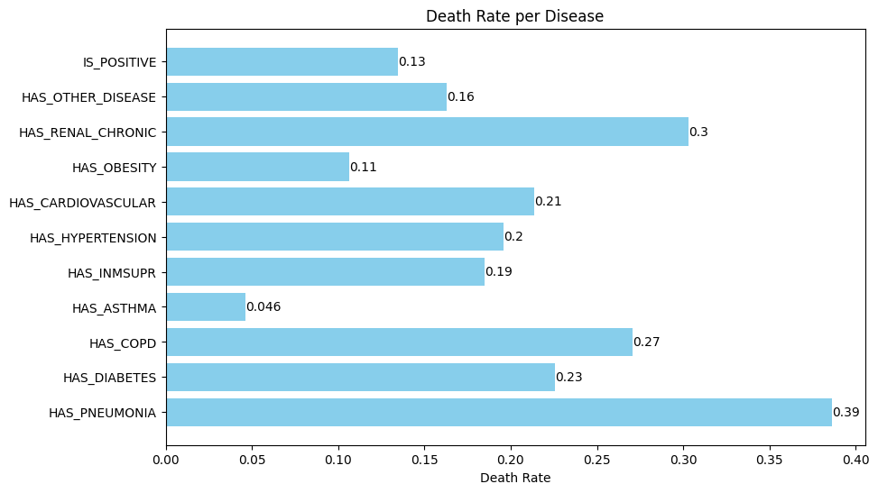

## Task 2: Predict Mortality Rate base on Medical history

Dataset used: [COVID-19 Dataset by MEIR NIZRI](https://www.kaggle.com/datasets/meirnizri/covid19-dataset)

Original data from [Gobierno de México - Información referente a casos COVID-19 en México](https://datos.gob.mx/busca/dataset/informacion-referente-a-casos-covid-19-en-mexico)

### 0. Dataset Information

#### 0.0 Attributes

These fields are excluded from our analysis due to irrelevancy to the problem:
| Field                     | Description |
|---------------------------|-------------|
| **USMER**                 | Indicates whether the patient is treated in USMER or not.|
| **MEDICAL_UNIT**          | Type of institution of the National Health System that provided the care.|
| **PREGNANT**              | Whether the patient is pregnant or not. |

These fields are used for analysis and model training:

|ID | Field                     | Description |
|---|---------------------------|-------------|
|1  | **SEX**                   | 1. Female</br>2. Male|
|2  | **PATIENT_TYPE**          | Type of care the patient received in the unit: </br>1. Returned home</br>2. Hospitalized |
|3  | **DATE_DIED**             | The date of death or '9999-99-99' otherwise.|
|4  | **INTUBED**               | Whether the patient was connected to the ventilator.|
|5  | **PNEUMONIA**             | Whether the patient already have air sacs inflammation or not.|
|6  | **AGE**                   | Age of the patient.|
|7  | **DIABETES**              | Whether the patient has diabetes or not.|
|8  | **COPD**                  | Whether the patient has Chronic Obstructive Pulmonary Disease or not. |
|9  | **ASTHMA**                | Whether the patient has asthma or not. |
|10 | **INMSUPR**               | Whether the patient is immunosuppressed or not.|
|11 | **HIPERTENSION**          | Whether the patient has hypertension or not.   |
|12 | **OTHER_DISEASE**         | Whether the patient has other disease or not.  |
|13 | **CARDIOVASCULAR**        | Whether the patient has heart or blood vessels related disease. |
|14 | **OBESITY**               | Whether the patient is obese or not.    |
|15 | **RENAL_CHRONIC**         | Whether the patient has chronic renal disease or not.  |
|16 | **TOBACCO**               | Whether the patient is a tobacco user.   |
|17 | **CLASIFFICATION_FINAL**  | Covid test results. </br>Values 1-3 mean that the patient was diagnosed with COVID in different degrees. </br>4-5 means the test is inconclusive. </br>4 = `INVÁLIDO POR LABORATORIO (INVALID BY LABORATORY)`</br>5 = `NO REALIZADO POR LABORATORIO (NOT PERFORMED BY LABORATORY)`</br>6 = `CASO SOSPECHOSO (SUSPECTED CASE)` (Probably negative) </br>7 means the patient is negative with COVID. |
|18 | **ICU**                   | Whether the patient had been admitted to an Intensive Care Unit.|


### 0.1: Data Filtering and Transformation

#### Filtering:
- 98, 99 = Missing values
- For `CLASIFFICATION_FINAL`, we remove entries == 4 or 5 because they may not be fit for analysis

``` python
df = pd.read_csv('Covid Data.csv')

conditions = [
    (df['INTUBED'] == 99),
    (df['PNEUMONIA'] == 99),
    (df['DIABETES'] == 98),
    (df['COPD'] == 98),
    (df['ASTHMA'] == 98),
    (df['INMSUPR'] == 98),
    (df['HIPERTENSION'] == 98),
    (df['OTHER_DISEASE'] == 98),
    (df['CARDIOVASCULAR'] == 98),
    (df['OBESITY'] == 98),
    (df['RENAL_CHRONIC'] == 98),
    (df['TOBACCO'] == 98),
    (df['CLASIFFICATION_FINAL'] == 4),
    (df['CLASIFFICATION_FINAL'] == 5),
    (df['ICU'] == 99)
]

df_filtered = df[~(reduce(lambda x, y: x | y, conditions))]
```

#### Transformation
- All columns except `AGE` is converted to a boolean value
- Column names are renamed for clarity
- The list of columns for our dataset after processing is:
```
IS_MALE, IS_SENT_HOME, IS_DEAD, IS_INTUBED, HAS_PNEUMONIA, AGE, HAS_DIABETES, HAS_COPD, 
HAS_ASTHMA, HAS_INMSUPR, HAS_HYPERTENSION, HAS_OTHER_DISEASES, HAS_CARDIOVASCULAR, 
HAS_OBESITY, HAS_RENAL_CHRONIC, USE_TOBACCO, IS_POSITIVE (COVID), IS_ICU
```

``` python
df_cleaned = pd.DataFrame()

def true_if_2(x):
    return True if x == 2 else False

def false_if_2(x):
    return False if x == 2 else True

df_cleaned['IS_MALE'] = df_filtered['SEX'].apply(true_if_2)
df_cleaned['IS_SENT_HOME'] = df_filtered['PATIENT_TYPE'].apply(false_if_2)

df_cleaned['IS_DEAD'] = df_filtered['DATE_DIED'].apply(lambda x: False if x == '9999-99-99' else True)
df_cleaned['IS_INTUBED'] = df_filtered['INTUBED'].apply(lambda x: False if (x == 2 or x == 97) else True)

df_cleaned['HAS_PNEUMONIA'] = df_filtered['PNEUMONIA'].apply(false_if_2)

df_cleaned['AGE'] = df_filtered['AGE']

df_cleaned['HAS_DIABETES'] = df_filtered['DIABETES'].apply(false_if_2)
df_cleaned['HAS_COPD'] = df_filtered['COPD'].apply(false_if_2)
df_cleaned['HAS_ASTHMA'] = df_filtered['ASTHMA'].apply(false_if_2)
df_cleaned['HAS_INMSUPR'] = df_filtered['INMSUPR'].apply(false_if_2)
df_cleaned['HAS_HYPERTENSION'] = df_filtered['HIPERTENSION'].apply(false_if_2)
df_cleaned['HAS_OTHER_DISEASE'] = df_filtered['OTHER_DISEASE'].apply(false_if_2)
df_cleaned['HAS_CARDIOVASCULAR'] = df_filtered['CARDIOVASCULAR'].apply(false_if_2)
df_cleaned['HAS_OBESITY'] = df_filtered['OBESITY'].apply(false_if_2)
df_cleaned['HAS_RENAL_CHRONIC'] = df_filtered['RENAL_CHRONIC'].apply(false_if_2)
df_cleaned['USE_TOBACCO'] = df_filtered['TOBACCO'].apply(false_if_2)

df_cleaned['IS_POSITIVE'] = df_filtered['CLASIFFICATION_FINAL'].apply(lambda x: True if (x in [1, 2, 3]) else False)
df_cleaned['IS_ICU'] = df_filtered['ICU'].apply(lambda x: False if (x == 2 or x == 97) else True)
```

### 1. Statistical Analysis

#### 1.0 Summary


*Figure 1: Summary of the dataset*

These are our observations of the summary of the dataset from figure 1:

1. **Gender**: The dataset is gender-balanced, allowing fair health outcome comparisons.

2. **Hospitalization**: Most individuals were not hospitalized, indicating less severe cases or specific healthcare strategies.

3. **Survival**: Most individuals were alive when data was collected, hinting at a low mortality rate, pending further data.

4. **Pre-existing Conditions**: Most individuals didn't have the listed diseases, suggesting these conditions are uncommon or don't significantly impact the outcomes studied.

5. **Age**: Most individuals are under 50, reflecting the population's age distribution or a higher likelihood of younger individuals experiencing the studied outcomes.

6. **COVID-19 Status**: Despite a significant number of positive COVID-19 cases, most individuals were not affected, indicating a diverse dataset.

In conclusion, the dataset offers a broad view of the population, encompassing various ages, genders, and health conditions.

#### 1.1 Correlation (Pearson)


*Figure 2: Pearson Correlation between the variables*

These are the observations we made from figure 2:

1.  **Hospitalization and Mortality**:

    A negative correlation (-0.52) between being sent home and mortality suggests better health outcomes for those not hospitalized. This is supported by a strong negative correlation with pneumonia (-0.65).


2. **Age and Health/Mortality**:

    Age has a positive correlation with mortality (0.32), pneumonia (0.28), diabetes (0.33), and hypertension (0.39), indicating older individuals are more likely to have these conditions and a higher mortality rate.

3. **COVID-19 Status and Health/Mortality**:

    Low correlations of COVID-19 positivity with mortality (0.19), intubation (0.12), pneumonia (0.2), and age (0.15) suggest being COVID-19 positive doesn’t necessarily lead to higher mortality or other diseases.

4. **Hypertension and Diabetes**:

    A moderate positive correlation (0.38) between hypertension and diabetes is expected due to common risk factors.

5. **ICU Admission and Intubation**:

    A positive correlation (0.37) between ICU (Intensive Care Unit) admission and intubation is logical as ICU patients often require interventions like intubation.

6. **Mortality Factors**:

    Strong positive correlations of mortality with intubation (0.51), pneumonia (0.47), and age (0.32) suggest these are significant factors associated with mortality.

7. **Gender and Smoking**:

    Low correlation of gender and smoking with mortality (0.08 and 0.01 respectively) suggests these factors don’t significantly affect the mortality rate.

8. **Other Diseases and Immunosuppression**:

    Low correlation of other diseases and immunosuppression with mortality (0.06 and 0.05 respectively) suggests these factors don’t significantly affect the mortality rate or presence of other conditions.

From the correlation analysis, here are our conclusions:

1. **Hospitalization and Mortality**: 
    
    `IS_SENT_HOME` could be a key predictor, as non-hospitalized individuals generally had lower mortality.

2. **Age and Health Conditions**: 
    
    `AGE`, `HAS_PNEUMONIA`, `HAS_DIABETES`, and `HAS_HYPERTENSION` could be important features, as older individuals are more likely to have these conditions and higher mortality.

3. **COVID-19 Status**: 
    
    `IS_POSITIVE` might be a less significant predictor, as being COVID-19 positive doesn't necessarily lead to higher mortality or other diseases.

4. **Hypertension and Diabetes**: 

    `HAS_HYPERTENSION` and `HAS_DIABETES` could be considered in your model, but beware of potential multicollinearity.

5. **ICU Admission and Intubation**: 
    
    `IS_ICU` and `IS_INTUBED` could be significant predictors, as ICU patients often require interventions like intubation.

6. **Mortality Factors**: 
    
    `AGE`, `IS_INTUBED`, and `HAS_PNEUMONIA` are likely to be important predictors, as they're strongly associated with mortality.

7. **Gender and Smoking**: 

    `IS_MALE` and `USE_TOBACCO` might be less important features, as they don't significantly affect mortality.

8. **Other Diseases and Immunosuppression**: 

    `HAS_OTHER_DISEASE` and `HAS_INMSUPR` might be less important features, as they don't significantly affect mortality or other conditions.

#### 1.2 Death rate by Disease



*Figure 3: Death rate by Disease*

From figure 3 we can make some observations: 

1. **Pneumonia**: With a death rate of 0.39, pneumonia is the most lethal condition, suggesting patients with pneumonia have a higher mortality risk.

2. **Renal Chronic & COPD**: These conditions have high death rates (0.3 and 0.27), indicating a higher mortality risk.

3. **Cardiovascular & Diabetes**: These conditions have moderate death rates (0.21 and 0.23), and could be significant mortality predictors.

4. **Hypertension & Immunosuppression**: These conditions have similar death rates (0.2 and 0.19), suggesting a moderate mortality risk.

5. **COVID-19 Status & Other Diseases**: These factors have low death rates (0.13 and 0.16), suggesting they may not significantly increase mortality risk.

6. **Obesity & Asthma**: These conditions have the lowest death rates (0.11 and 0.046), suggesting they may not be major mortality risk factors.

Comparing to the correlation analysis:

1. **Pneumonia**: Its high death rate and strong negative correlation with `IS_SENT_HOME` indicate it often requires hospitalization and is associated with higher death risk.

2. **Renal Chronic & COPD**: Their high death rates align with their moderate to strong correlations with `IS_DEAD`, indicating a higher mortality risk.

3. **Cardiovascular & Diabetes**: Their moderate death rates align with their moderate positive correlations with `AGE` and `IS_DEAD`, suggesting they could be significant mortality predictors.

4. **Hypertension & Immunosuppression**: Their similar death rates align with their moderate positive correlations with `AGE` and `IS_DEAD`.

5. **COVID-19 Status & Other Diseases**: Their low death rates align with their low correlations with `IS_DEAD`, suggesting they may not significantly increase mortality risk.

6. **Obesity & Asthma**: Their low death rates align with their low correlations with `IS_DEAD`, suggesting they may not be major mortality risk factors.

In conclusion, conditions like pneumonia, chronic renal disease, and COPD are strongly associated with mortality, while COVID-19 status, obesity, and asthma have less impact. High death rate conditions with strong correlations with `IS_DEAD` might be weighted more in the model.

#### 1.3 Disease count by Gender


*Figure 4: Disease count by gender*

1. **Pneumonia**: Males show a higher prevalence of pneumonia (~80,000) compared to females (~50,000), indicating a potential gender susceptibility or diagnostic differences.

2. **Diabetes, COPD, Hypertension, Cardiovascular, Renal Chronic**: The slight male dominance in these conditions is not significant, suggesting gender may not strongly influence their prevalence.

3. **Obesity, Other Diseases, Immunosuppression**: These conditions are more prevalent in females, possibly indicating a higher susceptibility or diagnostic differences.

For mortality prediction, gender may be crucial for conditions like pneumonia and obesity with noticeable gender differences. For conditions with insignificant gender differences, factors like age, hospitalization status, and comorbidity may be more relevant.

#### 1.4 Age composition by gender (Deaths and COVID-Positivity)


*Figure 5: Age composition by gender - Mortality*

1. **Age Distribution**: Mortality peaks at 30 years, with most deaths in the 20-65 age band, suggesting middle-aged individuals face higher mortality risk.

2. **Mortality Rate**: The significantly higher number of alive individuals indicates a relatively low overall mortality rate.

3. **Youth Mortality**: The low death counts in youth (0-20) suggest lower susceptibility to fatal outcomes.

4. **Gender Differences**: The slight excess of older males who die may not be significant and could reflect dataset bias.


*Figure 6: Age composition by gender - COVID*

1. **Infection Age Distribution**: COVID-19 infections are most common in the 25-65 age group, indicating middle-aged individuals are more likely to contract the virus.

2. **Youth Infections**: The presence of infections in very young people (0-20) highlights that no age group is entirely safe.

3. **Senior Infections**: Half the population past 65 is infected, suggesting high COVID-19 risk for seniors.

For mortality prediction based on medical history, age appears to be a significant factor. The risk of infection and mortality increases with age, peaking in middle age and remaining high in seniors.

#### 1.5 Age vs Death count


*Figure 7: Age vs Death*

1. **Age Distribution**: The dataset is skewed towards individuals aged 20-65, possibly reflecting the population’s demographic profile or the age group most affected by the studied conditions.

2. **Death Distribution**: The higher death count in older people highlights the increased mortality risk associated with age, potentially due to factors like chronic diseases and weaker immune systems.

3. **Older Age and Mortality**: The higher death count in older people highlights the increased mortality risk associated with age, potentially due to factors like chronic diseases and weaker immune systems.

In predicting mortality based on medical history, age is a significant factor. Mortality risk increases with age, peaking around 60. These findings are specific to this dataset and may not be universally applicable.


### 2. Basic Machine Learning (Logistic Regression, Naive Bayesian, Decision Tree, Ensemble)

#### 2.1 Training time


*Figure 8: Basic models' training time*

Random Forest and Gradient Boosting models took the longest to train due to their complexity. In contrast, Naive Bayes and Decision Tree models were quicker.

#### 2.2 Model accuracy


*Figure 9: Basic models' accuracy*

Gradient Boosting model showed the highest accuracy, followed by Logistic Regression and Random Forest models. Gaussian and Complement Naive Bayes models had the lowest accuracy scores. However, the accuracy variation between models is small, indicating good performance on this dataset.

#### 2.3 Confusion matrix

- **True Positives (TP)**: These are cases in which the model predicted the individual would die (`IS_DEAD`=1), and they did die.
- **True Negatives (TN)**: These are cases in which the model predicted the individual would not die (`IS_DEAD`=0), and they did not die.
- **False Positives (FP)**: These are cases in which the model predicted the individual would die, but they did not die.
- **False Negatives (FN)**: These are cases in which the model predicted the individual would not die, but they did die.

For each model, the confusion matrix is structured as follows:

```
[[TN, FP]
 [FN, TP]]
```


*Figure 10: Basic models' confusion matrices*

| Model | Highs | Lows | Pros | Cons |
| --- | --- | --- | --- | --- |
| Gaussian Naive Bayes | TN = 253,935, TP = 15,289 | FP = 22,921 | Good at predicting survival and death | May overestimate death risk, high false death prediction for survivors |
| Multinomial Naive Bayes | TN = 269,510, TP = 10,865 | FP = 7,346 | Excellent at predicting survival, low false death prediction for survivors | May underestimate death risk, lower true death prediction |
| Complement Naive Bayes | TN = 248,674, TP = 18,543 | FP = 28,182 | Good at predicting survival and death, high true death prediction | May overestimate death risk, highest false death prediction for survivors |
| Bernoulli Naive Bayes | TN = 258,940, TP = 16,174 | FP = 17,916 | Balanced prediction of survival and death | Moderate false death prediction for survivors |
| Decision Tree | TN = 271,281, TP = 9,850 | FP = 5,575 | Good at predicting survival, low false death prediction for survivors | May underestimate death risk, lowest true death prediction |
| Random Forest | TN = 270,999, TP = 10,578 | FP = 5,857 | Good overall performance, low false death prediction for survivors | Moderate true death prediction |
| Gradient Boosting | TN = 272,492, TP = 11,007 | FP = 4,364 | Excellent overall performance, lowest false death prediction for survivors | Moderate true death prediction |
| Logistic Regression Models | TN > 272,400, TP > 10,500 | - | Good overall performance, low false death prediction for survivors | Moderate true death prediction |

The "**Highs**" column refers to high counts of True Negatives (TN) and True Positives (TP), indicating good performance in correctly predicting survival and death. The "**Lows**" column refers to high counts of False Positives (FP), suggesting the model may overestimate the risk of death. The "**Pros**" and "**Cons**" columns summarize the strengths and weaknesses of each model.

For predicting mortality, consider these models:

1. **Complement Naive Bayes**: High True Positive rate, good at predicting death, but may overestimate death risk due to high False Positive rate.

2. **Bernoulli Naive Bayes**: Balanced prediction of survival and death, moderate rate of false death prediction, suitable if sensitivity and specificity are equally important.

3. **Gradient Boosting**: Excellent overall performance, lowest false death prediction, moderate true death prediction.

4. **Logistic Regression Models**: Good overall performance, low false death prediction, moderate true death prediction.

Prioritize models like Complement Naive Bayes for accurate death prediction. For avoiding overestimation of death risk, consider models like Gradient Boosting.

### 3. FFNN and RNN

#### FFNN

``` python
model_ffnn = Sequential()
model_ffnn.add(Dense(64, input_dim=X_train.shape[1], activation='relu'))
model_ffnn.add(Dense(32, activation='relu'))
model_ffnn.add(Dense(16, activation='relu'))
model_ffnn.add(Dense(1, activation='sigmoid'))

# Compile the model
model_ffnn.compile(loss='binary_crossentropy', optimizer='adam', metrics=['accuracy'])

# Train the model
history = model_ffnn.fit(X_train, y_train, epochs=50, batch_size=1000)
```

#### RNN

``` python
X_train_rnn = np.reshape(X_train, (X_train.shape[0], 1, X_train.shape[1]))
X_test_rnn = np.reshape(X_test, (X_test.shape[0], 1, X_test.shape[1]))

# Define the model
model_rnn = Sequential()
model_rnn.add(SimpleRNN(64, input_shape=(X_train_rnn.shape[1], X_train_rnn.shape[2]), activation='relu'))
model_rnn.add(Dense(32, activation='relu'))
model_rnn.add(Dense(16, activation='relu'))
model_rnn.add(Dense(1, activation='sigmoid'))

# Compile the model
model_rnn.compile(loss='binary_crossentropy', optimizer='adam', metrics=['accuracy'])

# Train the model
history_rnn = model_rnn.fit(X_train_rnn, y_train, epochs=50, batch_size=1000)
```


*Figure 11: FFNN vs RNN accuracy*


*Figure 12: FFNN vs RNN loss*

The FFNN and RNN models achieved comparable results with basic models. Accuracy increased from 0.93 to 0.95, and loss decreased from 0.16 to 0.11 over 50 epochs. Minor fluctuations in metrics are due to the stochastic nature of the Adam optimizer. Plateauing of accuracy and loss suggests models might have reached their learning capacity with the current data and architectures.

Classification reports:
```
FFNN Model:
              precision    recall  f1-score   support

         0.0       0.96      0.99      0.97    276856
         1.0       0.74      0.47      0.57     21500

    accuracy                           0.95    298356
   macro avg       0.85      0.73      0.77    298356
weighted avg       0.94      0.95      0.94    298356

[[273391   3465]
 [ 11436  10064]]

RNN Model:
              precision    recall  f1-score   support

         0.0       0.96      0.99      0.97    276856
         1.0       0.73      0.50      0.59     21500

    accuracy                           0.95    298356
   macro avg       0.84      0.74      0.78    298356
weighted avg       0.94      0.95      0.95    298356

[[272845   4011]
 [ 10832  10668]]
```


*Figure 13: FFNN vs RNN confusion matrices*

| Model | Highs | Lows | Pros | Cons |
| --- | --- | --- | --- | --- |
| FFNN | TN = 273,391, TP = 10,064 | FP = 3,465 | Good overall performance, low false death prediction | Moderate true death prediction |
| RNN | TN = 272,845, TP = 10,668 | FP = 4,011 | Good overall performance, low false death prediction | Moderate true death prediction |

- **Feedforward Neural Network (FFNN)**: Performs well overall with a low rate of false death predictions. However, its true death prediction rate is moderate. It has a high True Negative (TN) count of 273,391 and a True Positive (TP) count of 10,064, but a relatively low False Positive (FP) count of 3,465.

- **Recurrent Neural Network (RNN)**: Similar to FFNN, it performs well overall with a low rate of false death predictions. It has a slightly higher true death prediction rate than FFNN. The RNN has a TN count of 272,845, a TP count of 10,668, and a FP count of 4,011.

- **Basic Models (e.g., Gaussian Naive Bayes, Multinomial Naive Bayes, etc.)**: These models show varied performance. Some may overestimate the risk of death, while others may underestimate it. The rate of correctly predicting death also varies among these models.

In conclusion, both FFNN and RNN models perform well on this dataset, striking a good balance between predicting survival and death.

### 4. Overfitting Prevention

#### 4.1 Basic model

##### Cross-validation

| Model | Min Score | Max Score | Mean Score | Analysis |
| --- | --- | --- | --- | --- |
| Gaussian Naive Bayes | 0.9018 | 0.9030 | 0.9026 | Consistent and good performance |
| Multinomial Naive Bayes | 0.9391 | 0.9401 | 0.9396 | Very good and consistent performance |
| Complement Naive Bayes | 0.8954 | 0.8965 | 0.8960 | Good and consistent performance |
| Bernoulli Naive Bayes | 0.9210 | 0.9232 | 0.9217 | Very good and consistent performance |
| Decision Tree | 0.9412 | 0.9420 | 0.9416 | Very good and consistent performance |
| Random Forest | 0.9426 | 0.9441 | 0.9437 | Very good and consistent performance |
| Gradient Boosting | 0.9495 | 0.9502 | 0.9499 | Excellent and consistent performance |
| Logistic Regression Models | 0.9482 | 0.9489 | 0.9486 | Excellent and consistent performance |

The "Min Score" and "Max Score" columns show the range of cross-validation scores for each model, while the "Mean Score" column shows the average score. The "Analysis" column provides a brief interpretation of these scores. 

##### Feature selection

We performed Feature Selection for top 10 features. 
``` python
selector = SelectKBest(score_func=f_classif, k=10)  # Select top 10 features
X_new = selector.fit_transform(X_train, y_train)

# Get columns to keep and create new dataframe with those only
cols = selector.get_support(indices=True)
X_train_new = X_train.iloc[:,cols]
X_test_new = X_test.iloc[:,cols]
```

The features selected are
```
['IS_SENT_HOME', 'IS_INTUBED', 'HAS_PNEUMONIA', 'AGE', 'HAS_DIABETES', 
'HAS_COPD', 'HAS_HYPERTENSION', 'HAS_RENAL_CHRONIC', 'IS_POSITIVE','IS_ICU']
```

The features discarded are
```
['IS_MALE', 'HAS_ASTHMA', 'HAS_INMSUPR', 'HAS_OTHER_DISEASE', 
'HAS_CARDIOVASCULAR', 'HAS_OBESITY', 'USE_TOBACCO',]
```

This is consistent with our findings in the correlation between variables.


*Figure 14: Training time comparison with and without feature selection*

We see


*Figure 14: Model accuracy comparison with and without feature selection*

The results indicate that reducing the number of features from 17 to 10 significantly decreased the training time for all models. This is due to the reduced computational complexity associated with fewer features. 

However, the accuracy of the models did not improve significantly. In some cases, there was even a slight decrease in accuracy. This suggests that the discarded features may not have significantly contributed to the model’s predictive accuracy.

In conclusion, feature selection has enhanced the efficiency of the models in terms of computational resources and time, without significantly affecting their performance. This represents a common trade-off between efficiency and performance in machine learning and data science.

#### 4.2 FFNN, RNN

To prevent overfitting in Feedforward Neural Networks (FFNN) and Recurrent Neural Networks (RNN), several strategies were employed:

1. **Regularization**: The `kernel_regularizer` parameter was added to the `Dense` layers. This L2 regularization penalizes large weights by adding a penalty to the loss function, helping to prevent overfitting.

2. **Dropout**: `Dropout` layers were introduced after each `Dense` layer. These layers randomly nullify approximately half of the input units during each training update, which aids in overfitting prevention.

3. **Early Stopping**: This form of regularization halts the training process when the model's performance on a validation dataset ceases to improve after a certain number of epochs. In this case, if 'val_loss' doesn't improve after 10 epochs, training is stopped.

FFNN
``` python
model_ffnn_new = Sequential()
model_ffnn_new.add(Dense(64, input_dim=X_train.shape[1], activation='relu', kernel_regularizer=regularizers.l2(0.01)))
model_ffnn_new.add(Dropout(0.5))
model_ffnn_new.add(Dense(32, activation='relu', kernel_regularizer=regularizers.l2(0.01)))
model_ffnn_new.add(Dropout(0.5))
model_ffnn_new.add(Dense(16, activation='relu', kernel_regularizer=regularizers.l2(0.01)))
model_ffnn_new.add(Dropout(0.5))
model_ffnn_new.add(Dense(1, activation='sigmoid'))

# Compile the model
model_ffnn_new.compile(loss='binary_crossentropy', optimizer='adam', metrics=['accuracy'])

# Add early stopping
early_stopping = EarlyStopping(monitor='val_loss', patience=10)

# Train the model
history_ffnn_new = model_ffnn_new.fit(X_train, y_train, epochs=50, batch_size=1000, validation_split=0.2, callbacks=[early_stopping])
```

RNN
``` python
X_train_rnn = np.reshape(X_train, (X_train.shape[0], 1, X_train.shape[1]))
X_test_rnn = np.reshape(X_test, (X_test.shape[0], 1, X_test.shape[1]))

# Define the model
model_rnn = Sequential()
model_rnn.add(SimpleRNN(64, input_shape=(X_train_rnn.shape[1], X_train_rnn.shape[2]), activation='relu', return_sequences=True, dropout=0.2, recurrent_dropout=0.2))
model_rnn.add(Dense(32, activation='relu', kernel_regularizer=regularizers.l2(0.01)))
model_rnn.add(Dropout(0.5))
model_rnn.add(Dense(16, activation='relu', kernel_regularizer=regularizers.l2(0.01)))
model_rnn.add(Dropout(0.5))
model_rnn.add(Dense(1, activation='sigmoid'))

# Compile the model
model_rnn.compile(loss='binary_crossentropy', optimizer='adam', metrics=['accuracy'])

# Add early stopping
early_stopping = EarlyStopping(monitor='val_loss', patience=10)

# Train the model
history_rnn_new = model_rnn.fit(X_train_rnn, y_train, epochs=50, batch_size=1000, validation_split=0.2, callbacks=[early_stopping])
```


*Figure 15: FFNN accuracy between original and modified*


*Figure 16: FFNN loss between original and modified*


*Figure 17: RNN accuracy between original and modified*


*Figure 18: RNN loss between original and modified*

We can see that for the modified RNN model, there is an early stopping at around 38 epochs, which means there might be actual overfitting in the original model.

The Feed-Forward Neural Network (FFNN) and Recurrent Neural Network (RNN) models, after modifications to prevent overfitting, showed a decrease in accuracy of about 0.02. This could be due to the added regularization and dropout layers.

The loss for both models increased by approximately 0.05 in the modified versions, suggesting that they may not fit the training data as well as the original models. This could be attributed to the added complexity from the regularization and dropout layers.

In conclusion, while the modifications were intended to prevent overfitting, they seem to have resulted in slight underfitting, as indicated by the decreased accuracy and increased loss. These results suggest that further tuning of the model parameters or exploration of other overfitting prevention methods might be beneficial.

### 5. Result analysis and Methods for Improvement in Accuracy

#### 5.1 Result Analysis

The models developed in this study, including basic models (e.g., Logistic Regression, Gradient Boosting), Feedforward Neural Network (FFNN), and Recurrent Neural Network (RNN), demonstrated good performance in predicting mortality based on medical history, with accuracy ranging from 0.90 to 0.95.

However, there were performance variations among the models. The Gradient Boosting and Logistic Regression models achieved the highest accuracy, while the Naive Bayes models had the lowest. The FFNN and RNN models showed comparable results with the basic models, but with a slight accuracy decrease after implementing overfitting prevention techniques.

In terms of feature importance, conditions like pneumonia, chronic renal disease, and COPD were strongly associated with mortality, while factors like COVID-19 status, obesity, and asthma had less impact. Age was also a significant factor, with mortality risk increasing with age.

#### 5.2 Methods for Improvement in Accuracy

While the models have shown good performance, there are several methods that could potentially improve their accuracy:

1. **Hyperparameter Tuning**: Performance can often be improved by tuning model hyperparameters using techniques such as grid search or random search.

2. **Feature Engineering**: Creating new features from existing data can sometimes enhance model performance. For instance, interaction terms between different diseases could be added to capture the combined effect of multiple conditions.

3. **Advanced Models**: More advanced models, such as XGBoost or LightGBM, could potentially improve accuracy due to their ability to handle complex interactions and non-linear relationships.

4. **Deep Learning**: More complex neural network architectures, such as Convolutional Neural Networks (CNNs) or Long Short-Term Memory networks (LSTMs), could be explored.

5. **Ensemble Methods**: Combining the predictions of multiple models can often lead to better performance than any single model.

6. **Data Augmentation**: If the dataset is imbalanced or small, data augmentation techniques can be used to increase the size and diversity of the training data.